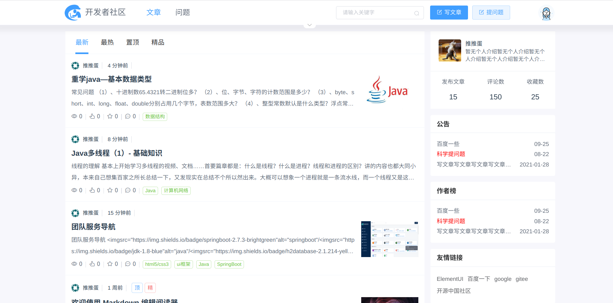
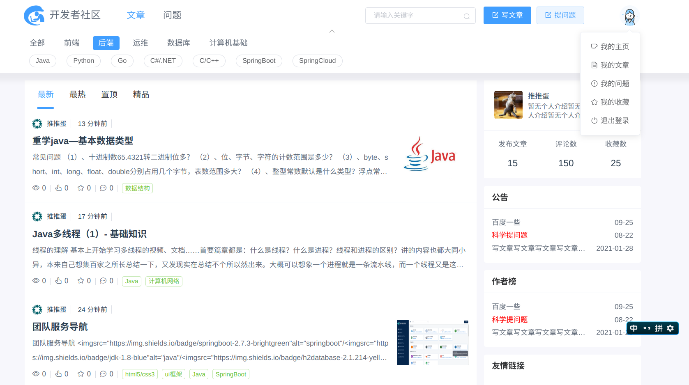
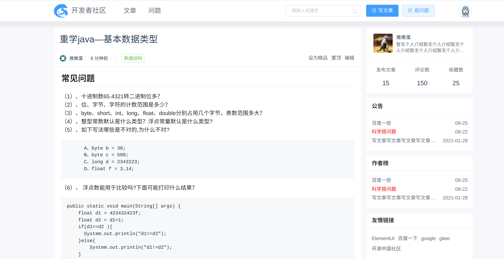
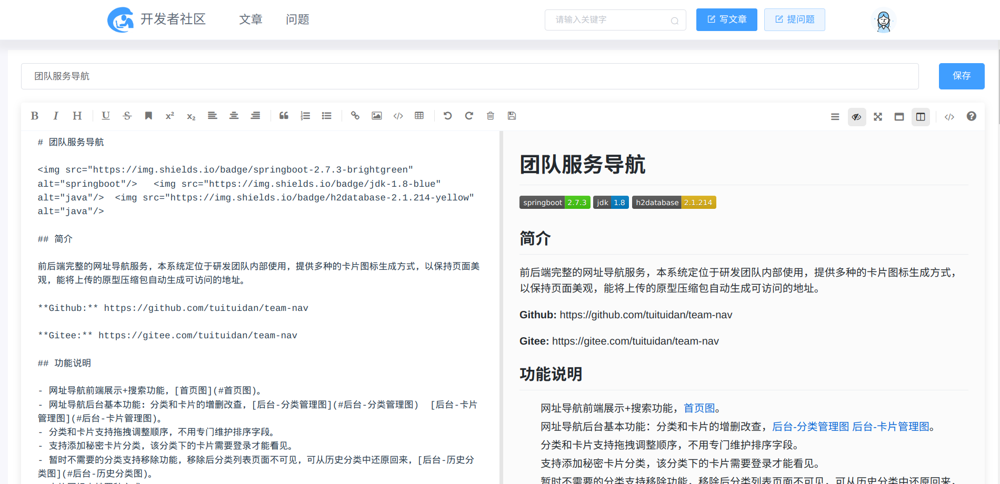
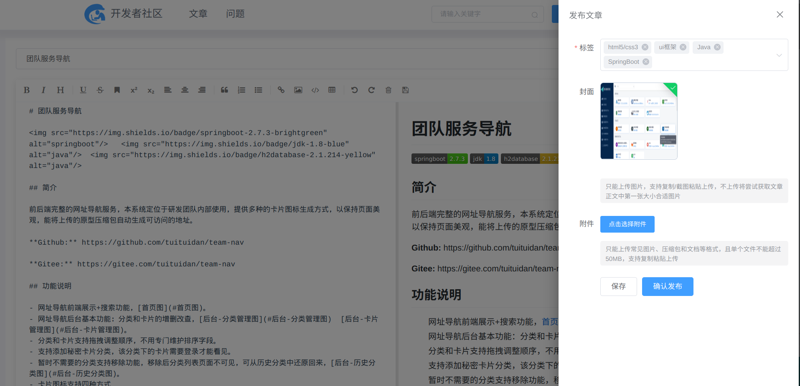

# 开发者社区

      

## 简介

在一些团队技术管理工作中，比如培训，设计评审，代码复查等，使用技术博客来管理是非常方便的，网上找了一波，发现很多要么样式或功能达不到我想要的，要么就不是全部开源，所以就萌生了自己写一个的想法，本项目基于MIT协议，所有代码完全开源。

未完待续。。。。

基础框架依赖【https://github.com/tuituidan/tresdin】，因暂时未完成，故未推送到中央仓库
需自行将【https://github.com/tuituidan/tresdin】打包到本地仓库

页面预览

#### 首页

#### 首页（标签搜索）

#### 文章详情

#### 文章编辑

#### 文章发布

